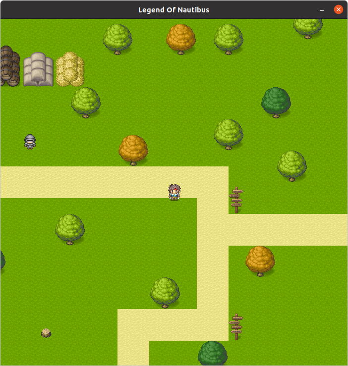

<p align="center">
  <a href="" rel="noopener">
 </a>
</p>

<h2 align="center">Projet SFL</h2>

<div align="center">

[]()


</div>

---

<p align="center"> Game made for an academic projet by students of the Lyon 1 Claude Bernard University.
    <br> 

</p>

## 📝 Table of Contents

- [About](#about)
- [Getting Started](#getting_started)
- [Running the tests](#tests)
- [Usage](#usage)
- [Documentation](#documentation)
- [Built Using](#built_using)
- [Specifications](#specifications)
- [UML Class Diagram](#diagram)
- [Trello Board](#trello)
- [Create your own map with Tiled](#map)
- [Authors](#authors)


## 🧐 About <a name = "about"></a>

2D 'Zelda like' game. Explore the open-world to fight your ennemies and fulfill the request of the NPCs. <br> Available on Linux and MacOS. 


## 🏁 Getting Started <a name = "getting_started"></a>

These instructions will get you a copy of the project up and running on your local machine.


### Prerequisites

What things you need to install the game and how to install them.

- For LINUX : `G++, SFML` 
- For MacOSX : `G++` (SFML files are included in the project)
- To update the documentation : `Doxygen, graphviz`

WSL is not working with this game

You can install them with your favorite package manager like :
```
sudo apt-get install libsfml-dev 
```

### Folder structure
<details>
<summary>Folders tree</summary>

```
├── bin
│
├── data
│   ├── fonts
│   ├── maps
│   ├── sounds
│   └── textures
│
├── doc
│   ├── html
│   │   └── index.html
│   └── sfl.doxy
│
├── extern
│   └── SFML
│
├── image.png
│
├── Makefile
│
├── obj
│
├── README.md
│
└── src
    ├── Core
    │   ├── Entity
    │   ├── Game.cpp
    │   ├── Game.h
    │   ├── Map
    │   └── StateManager
    │
    ├── main.cpp
    │
    ├── SFML
    │
    └── txt
```
</details>

### Installing

- Open a terminal to the project root directory.

- Compile with 
```
make
```  

- Clear all the objects and executables files with
```
make clean
``` 


## 🔧 Running the tests <a name = "tests"></a>

You can run all the class tests by running the following executable

```
./bin/exec 2
``` 


## 🎈 Usage <a name="usage"></a>

After compiling :


### SFML version
- Execute the SFML version with
```
./bin/exec 0
``` 

- To move along all axis use : ̀`Z Q S F`
- To pause the game : `escape`
- To restart the game after Game Over : `Space`
- To mute the sound of the game press : `m`
- To open the debug mode press : `p`
- To quit press : `x` or the cross button.

<b>Note</b> : fullscreen behaviors are unpredictable. Only in-game screen resizing is recommended


### Text version

The player is represented by a 'O', the enemies by 'E' and the collision boxes by 'X'

- Execute the text version with
```
./bin/exec 1
``` 

- To move along all axis use : ̀`Z Q S F`
- To quit press : `x` or the cross button.


## 📘 Documentation <a name = "documentation"></a>

- You can access to the actual documentation [here](http://safa.pages.univ-lyon1.fr/projet-sfl/index.html).

- You can open the documentations with your favorite navigator : `doc/html/index.html`

- You can update the documentation with 
```
make docs
```


## ⛏️ Built Using <a name = "built_using"></a>

- [SFML](https://www.sfml-dev.org/index-fr.php) - GUI Library
- [G++](https://gcc.gnu.org/) - C++ Compiler
- [Tiled](https://www.mapeditor.org/) - Map editor
- [Doxygen](https://www.doxygen.nl/index.html) - Documentation from source code
- [Graphviz](https://graphviz.org/) - Documentation images


## 🗓️ Specifications <a name="specifications"></a>
You can find our [specifications](https://docs.google.com/document/d/1M3ReGvUai9tsUhxqgG_X2tHgvNp70VFRoiY18aw6FXw/edit#heading=h.z6ne0og04bp5).


## 🔄 UML Class Diagram <a name="diagram"></a>
You can find our UML [Class Diagram](https://app.diagrams.net/?state=%7B%22ids%22:%5B%221cDj2nZ69OLlIY6NArtj_65bF8BKCwmA5%22%5D,%22action%22:%22open%22,%22userId%22:%22101499938783679469280%22,%22resourceKeys%22:%7B%7D%7D).


## 📌 Trello Board <a name="trello"></a>
You can find our [Trello Board ](https://trello.com/b/tu5E8z0s/projet-sfl).


## 🗺️ Create your own maps with the Tiled software : <a name="map"></a>
### Collision and spawn layers :
You should use object layers named :
- "PlayerSpawn" for the spawn of players
- "EnemySpawn" for spawns of enemies
- "Collision" for every objects that players, NPC and enemies couldn't go throught


## ✍️ Authors <a name = "authors"></a>

- [Farès SIONI](https://forge.univ-lyon1.fr/p1907037)
- [Stanislas BAGNOL](https://forge.univ-lyon1.fr/p1909886)
- [Lyes CHOUGAR](https://forge.univ-lyon1.fr/p1925126)

