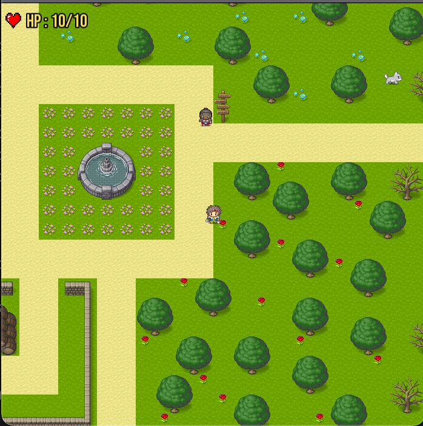

# Projet SFL



## Required :
- For LINUX : `G++, SFML` 
- For MacOSX : `G++` (SFML files are included in the project)
- To update the documentation : `Doxygen, graphviz`

## How to use
Open a terminal.
- Compile using `Make`.
- Execute `./bin/exec 0` for SFML, `./bin/exec 1` for txt, `./bin/exec 2` for all the tests running
- Clean all the object files and executables with `Make clean`.
- To open the documentation on a navigator : `doc/html/index.html`
- To update the documentation use `Make docs`
### For SFML mode :
Use `Z Q S D` to move along all axis. Press `P` for Debug mode. Press `X` or `Escape` to quit.
### For txt mode :
Use `Z Q S D` to move along all axis. Press `X` to quit.
The player is represented by a 'O', the enemies by 'E' and the collision boxes by 'X'

## Specifications 
You can find our specifications [here](https://docs.google.com/document/d/1M3ReGvUai9tsUhxqgG_X2tHgvNp70VFRoiY18aw6FXw/edit#heading=h.z6ne0og04bp5).

## UML Class Diagram
You can find our UML Class Diagram [here](https://app.diagrams.net/?state=%7B%22ids%22:%5B%221cDj2nZ69OLlIY6NArtj_65bF8BKCwmA5%22%5D,%22action%22:%22open%22,%22userId%22:%22101499938783679469280%22,%22resourceKeys%22:%7B%7D%7D).

## Trello Board
You can find our Trello Board [here](https://trello.com/b/tu5E8z0s/projet-sfl).


## Creating your own maps with the Tiled software :
### Collision and spawn layers :
You should use object layers named :
- "PlayerSpawn" for the spawn of players
- "EnemySpawn" for spawns of enemies
- "Collision" for every objects that players, NPC and enemies couldn't go throught


<p align="center">
  <a href="" rel="noopener">
 </a>
</p>

<h3 align="center">Project Title</h3>

<div align="center">

[]()
[](https://github.com/kylelobo/The-Documentation-Compendium/issues)
[](https://github.com/kylelobo/The-Documentation-Compendium/pulls)
[](/LICENSE)

</div>

---

<p align="center"> Few lines describing your project.
    <br> 
</p>

## 📝 Table of Contents

- [About](#about)
- [Getting Started](#getting_started)
- [Deployment](#deployment)
- [Usage](#usage)
- [Built Using](#built_using)
- [TODO](../TODO.md)
- [Contributing](../CONTRIBUTING.md)
- [Authors](#authors)
- [Acknowledgments](#acknowledgement)

## 🧐 About <a name = "about"></a>

Write about 1-2 paragraphs describing the purpose of your project.

## 🏁 Getting Started <a name = "getting_started"></a>

These instructions will get you a copy of the project up and running on your local machine for development and testing purposes. See [deployment](#deployment) for notes on how to deploy the project on a live system.

### Prerequisites

What things you need to install the software and how to install them.

```
Give examples
```

### Installing

A step by step series of examples that tell you how to get a development env running.

Say what the step will be

```
Give the example
```

And repeat

```
until finished
```

End with an example of getting some data out of the system or using it for a little demo.

## 🔧 Running the tests <a name = "tests"></a>

Explain how to run the automated tests for this system.

### Break down into end to end tests

Explain what these tests test and why

```
Give an example
```

### And coding style tests

Explain what these tests test and why

```
Give an example
```

## 🎈 Usage <a name="usage"></a>

Add notes about how to use the system.

## 🚀 Deployment <a name = "deployment"></a>

Add additional notes about how to deploy this on a live system.

## ⛏️ Built Using <a name = "built_using"></a>

- [MongoDB](https://www.mongodb.com/) - Database
- [Express](https://expressjs.com/) - Server Framework
- [VueJs](https://vuejs.org/) - Web Framework
- [NodeJs](https://nodejs.org/en/) - Server Environment

## ✍️ Authors <a name = "authors"></a>

- [@kylelobo](https://github.com/kylelobo) - Idea & Initial work

See also the list of [contributors](https://github.com/kylelobo/The-Documentation-Compendium/contributors) who participated in this project.

## 🎉 Acknowledgements <a name = "acknowledgement"></a>

- Hat tip to anyone whose code was used
- Inspiration
- References
